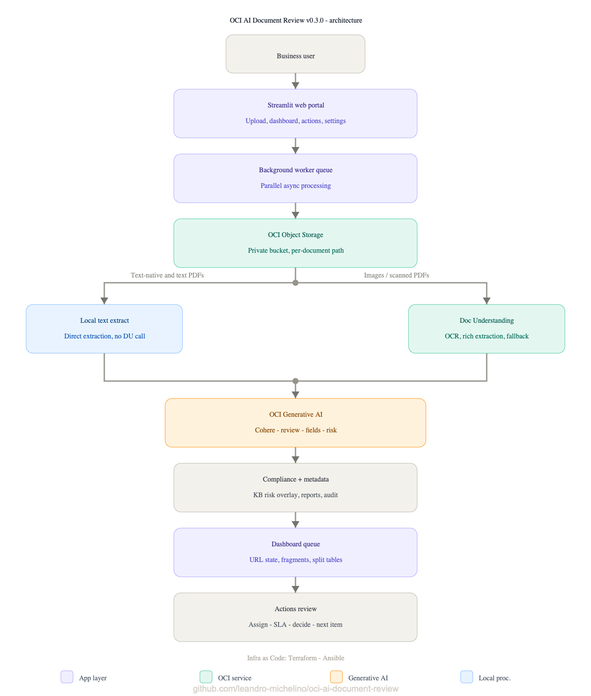

# OCI AI Document Review Portal

Contact: Leandro Michelino | ACE | leandro.michelino@oracle.com. In case of any question, get in touch.

OCI AI Document Review Portal is a deployable Oracle Cloud Infrastructure reference application for AI-assisted business document review. It gives reviewers a working upload, OCR, generative AI, compliance routing, dashboard, approval, rejection, retry, audit, and report-download workflow while keeping the final business decision with a human.

Current version: `v0.6.1`

Maintainer: Leandro Michelino | ACE | leandro.michelino@oracle.com

## Work In Progress

A quick, honest note: OCI AI Document Review Portal is still an active work in progress. The core platform, deployment path, document-processing flow, and reviewer dashboard experience are evolving quickly, but it is not being presented as a fully finished product yet.

Some live-provider workflows depend on OCI account details, IAM policies, subscribed regions, service limits, Object Storage configuration, Document Understanding access, Generative AI model availability, and customer document samples that are not all available in every test environment. If you are interested in running a real pilot, validating it with your own OCI tenancy and document data, or shaping the next set of features, please get in touch.

## Contents

- [Work In Progress](#work-in-progress)
- [Why This Exists](#why-this-exists)
- [What It Does](#what-it-does)
- [Architecture](#architecture)
- [Processing Flow](#processing-flow)
- [Quick Start](#quick-start)
- [Configuration](#configuration)
- [Operations](#operations)
- [Security Model](#security-model)
- [Project Layout](#project-layout)
- [Documentation](#documentation)
- [Roadmap](#roadmap)
- [Versioning](#versioning)
- [License](#license)

## Why This Exists

Business reviewers often receive receipts, invoices, contracts, reports, and compliance files in formats that are hard to compare quickly. This project turns those files into a structured review queue:

- users upload one document or a small related submission;
- the platform stores the original file privately in OCI Object Storage;
- text is extracted locally when possible and with OCI Document Understanding when OCR is needed;
- OCI Generative AI creates a structured review summary, risks, recommendations, and extracted business details;
- a curated compliance knowledge base adds deterministic review-routing signals;
- reviewers approve, reject, retry, assign, comment, and download reports from a Streamlit portal.

It is not a blind auto-approval system. It is a human-in-the-loop review platform that reduces manual reading and makes the decision trail easier to inspect.

## What It Does

| Area | Capability |
| --- | --- |
| Upload | Single-file upload or up to five related files per submission. Multi-file submissions require an expense name or reference so related files stay grouped. |
| Extraction | Local extraction for text-native files and PDFs with selectable text. OCI Document Understanding OCR for images, scanned PDFs, and image-only PDFs. |
| Large scanned PDFs | Automatic split into limit-safe temporary chunks for synchronous Document Understanding calls, with cleanup after merge. |
| AI review | OCI Generative AI generates structured summaries, fields, risks, missing information, recommendations, and receipt or invoice line items when visible. |
| Compliance overlay | A curated Object Storage CSV/JSON catalog flags public-sector expense cues with auditable evidence and `LOW`, `MEDIUM`, or `HIGH` severity. |
| Workflow | Dashboard queues, Actions review screen, dedicated Reviewed archive, approve/reject decisions, owner assignment, SLA date, comments, audit trail, retry history, source-document download, and an ERP handoff integration slot after decisions targeting SAP, Oracle Fusion, or a custom API. |
| Reporting | Local JSON metadata plus Markdown review reports for download. |
| Retention | VM-local metadata, reports, upload working copies, and Object Storage document objects are retained for 30 days by default. |
| Optional automation | OCI Events and OCI Functions can ingest files uploaded to Object Storage under `incoming/`. |

The Streamlit app exposes six main pages:

- `Upload`: queue new documents and grouped submissions.
- `Dashboard`: monitor processing, ready reviews, failures, reviewed items, search, filters, and grouped submissions.
- `Actions`: perform approval, rejection, retry, workflow assignment, comments, source download, and audit review.
- `Reviewed`: browse approved and rejected documents with search and decision filters.
- `How To Use`: in-app operating guidance.
- `Settings`: runtime configuration and live OCI Preflight checks.

## Architecture



The deployed MVP is intentionally simple and inspectable:

```text
+----------------+       +--------------------------+
| User Browser   | ----> | OCI Compute VM           |
| Streamlit UI   |       | Streamlit + worker pool  |
+----------------+       +------------+-------------+
                                      |
                                      v
                         +--------------------------+
                         | Private Object Storage   |
                         | documents/ + compliance/ |
                         +------------+-------------+
                                      |
          +---------------------------+---------------------------+
          |                                                       |
          v                                                       v
+----------------------+                          +----------------------------+
| Local text extract   |                          | OCI Document Understanding |
| TXT / CSV / PDF text |                          | OCR + rich extraction      |
+----------+-----------+                          +-------------+--------------+
           |                                                       |
           +---------------------------+---------------------------+
                                       |
                                       v
                         +--------------------------+
                         | OCI Generative AI        |
                         | Structured review        |
                         +------------+-------------+
                                      |
                                      v
                         +--------------------------+
                         | Compliance risk overlay  |
                         | Metadata + report        |
                         +------------+-------------+
                                      |
                                      v
                         +--------------------------+
                         | Dashboard + Actions      |
                         +------------+-------------+
                                      |
                                      v
                         +--------------------------+
                         | ERP Handoff (optional)   |
                         | SAP / Oracle Fusion /    |
                         | Custom API               |
                         +------------+-------------+
                                      |
                                      v
                         +--------------------------+
                         | Reviewed archive         |
                         | Closed decisions         |
                         +--------------------------+
```

Deeper diagrams, sequence flows, lifecycle states, refresh behavior, and deployment flows are in [docs/architecture_flows.md](docs/architecture_flows.md).

## Processing Flow

When a user queues a file set, the portal creates one metadata record per file and hands processing to the background worker pool so the browser does not wait on OCR or GenAI calls.

```text
Upload
  -> local working copy
  -> UPLOADED metadata record
  -> background worker queue
  -> private Object Storage upload
  -> local extraction or Document Understanding OCR
  -> DU text-only fallback when rich extraction fails
  -> OCI Generative AI structured review
  -> compliance knowledge-base match
  -> metadata JSON and Markdown report
  -> Dashboard queue
  -> Actions human decision
  -> approve, reject, retry, assign, comment, or audit
  -> Reviewed archive for closed decisions
  -> optional ERP handoff target such as SAP, Oracle Fusion, or API
```

Important behavior:

- Text-native documents skip Document Understanding and go directly to GenAI after local extraction.
- Images and scanned PDFs use Document Understanding before GenAI.
- Empty extraction fails clearly instead of sending empty content to GenAI.
- GenAI content-safety blocks are converted into reviewer-safe manual-review messages instead of exposing raw provider JSON.
- Documents matching the compliance catalog stay in the Ready queue as `Compliance review`.
- Failed documents can be retried from the preserved local working copy.

## Quick Start

### Prerequisites

- Python 3.11 or later
- Terraform 1.x
- Ansible and `ansible-galaxy`
- OCI CLI config with an API key
- OCI IAM permissions for Object Storage, Document Understanding, Generative AI, Compute, Networking, and the target compartment resources
- SSH public/private key pair for VM access

### End-to-end laptop deployment

Run the root setup wrapper from the repository root:

```bash
./setup.sh
```

The wrapper:

1. creates or refreshes `.venv`;
2. installs Python dependencies;
3. runs the guided OCI setup wizard;
4. writes local `.env` and `terraform/terraform.tfvars`;
5. runs `ruff`, `pytest`, Terraform validation, and Ansible syntax validation;
6. provisions or updates OCI infrastructure;
7. deploys the app with Ansible;
8. restarts the Streamlit service;
9. verifies the public portal URL from the laptop;
10. prints what Terraform deployed, what Ansible configured, the portal URL, SSH command, and operations commands.

Useful modes:

```bash
./setup.sh --configure-only
./setup.sh --deploy-only
./setup.sh --skip-checks
```

Pass setup wizard flags through the wrapper for repeatable deployments:

```bash
./setup.sh --non-interactive --yes \
  --compartment-id ocid1.compartment.oc1..exampleproject \
  --parent-compartment-id ocid1.compartment.oc1..exampleparent \
  --home-region us-ashburn-1 \
  --runtime-region us-ashburn-1 \
  --allowed-ingress-cidr 203.0.113.10/32
```

### Manual local environment

For development or advanced recovery:

```bash
python3.11 -m venv .venv
source .venv/bin/activate
pip install -r requirements-dev.txt
python scripts/setup.py
```

After the wizard writes `.env` and `terraform/terraform.tfvars`, deploy:

```bash
./scripts/deploy.sh
```

Run the Streamlit app locally when `.env` is already configured:

```bash
streamlit run app.py --server.maxUploadSize=10
```

Use your configured `MAX_UPLOAD_MB` value if you changed the default.

## Configuration

The setup wizard is the recommended way to create configuration. It reads your OCI profile, validates OCI access, discovers subscribed regions, discovers the Object Storage namespace, normalizes ingress CIDR values, probes supported OCI Generative AI Cohere chat models, and writes local-only files.

Generated files:

```text
.env
terraform/terraform.tfvars
```

Neither file should be committed.

Core runtime settings:

| Setting | Default | Purpose |
| --- | --- | --- |
| `OCI_REGION` | wizard selected | Runtime region for Compute, Object Storage, and Document Understanding. |
| `GENAI_REGION` | wizard selected | OCI Generative AI inference region. |
| `OCI_BUCKET_NAME` | `doc-review-input` | Private bucket for source documents and compliance catalog. |
| `GENAI_MODEL_ID` | `cohere.command-r-plus-08-2024` | Cohere chat model used by the runtime. |
| `MAX_PARALLEL_JOBS` | `5` | Background worker thread count. |
| `MAX_UPLOAD_MB` | `10` | Per-file upload size limit. Ansible passes the same value to Streamlit's `server.maxUploadSize` so the uploader and app validation agree. |
| `MAX_DOCUMENT_CHARS` | `50000` | Extracted character limit sent to GenAI. |
| `RETENTION_DAYS` | `30` | VM-local artifact and Object Storage document retention period. |
| `COMPLIANCE_ENTITIES_OBJECT_NAME` | `compliance/public_sector_entities.csv` | Object Storage path for the compliance knowledge base. |
| `EVENT_INTAKE_ENABLED` | `false` | Enables optional Object Storage Events and Functions intake. |

Full setup flags are documented in [docs/platform_usage.md](docs/platform_usage.md) and [terraform/README.md](terraform/README.md).

## Compliance Knowledge Base

The compliance router uses a curated file instead of asking GenAI to search the internet. By default the app reads:

```text
compliance/public_sector_entities.csv
```

If the object is missing, the app seeds it from:

```text
data/compliance/public_sector_entities.csv
```

During processing, the app checks extracted text, file name, expense name or reference, notes, and selected AI fields against the catalog. Matches create a public-sector expense compliance risk note with evidence such as source object, matched term, entity type, country, source, and source date. This is a routing control for reviewers, not a legal determination.

## Optional Automatic Intake

The standard path is browser upload. Automatic intake can be enabled when external systems need to drop files into Object Storage.

```text
external system
  -> Object Storage incoming/<expense-name-or-reference>/<file>
  -> OCI Events
  -> functions/object_intake
  -> Object Storage event-queue/<marker>.json
  -> VM polling timer
  -> normal metadata and worker queue
```

Enable it only after building and pushing the Function image to OCIR:

```bash
python scripts/setup.py \
  --compartment-id ocid1.compartment.oc1..exampleproject \
  --parent-compartment-id ocid1.compartment.oc1..exampleparent \
  --home-region us-ashburn-1 \
  --runtime-region us-ashburn-1 \
  --allowed-ingress-cidr 203.0.113.10/32 \
  --enable-automatic-processing \
  --automatic-processing-function-image <region-key>.ocir.io/<namespace>/<repo>:<tag>
```

Setup normalizes incoming and queue prefixes as relative Object Storage prefixes, and Terraform rejects empty, absolute, or parent-directory prefix values before apply.

Function-specific details are in [functions/object_intake/README.md](functions/object_intake/README.md).

## Operations

### Deploy code changes

GitHub is source control, not the live deployment target. A commit and push do not update the running VM. To deploy a source change:

```bash
./setup.sh --deploy-only
```

For code-only changes, Terraform should normally show no infrastructure changes while Ansible refreshes `/opt/oci-ai-document-review`, writes runtime config, installs dependencies if needed, and restarts the service.

### Verify the live VM

Use the Terraform output or setup summary for the VM IP, then verify service health:

```bash
ssh -i ~/.ssh/id_rsa opc@<vm-public-ip> \
  "sudo systemctl is-active oci-ai-document-review"

curl -fsS -I http://<vm-public-ip>:8501
```

Before processing real documents, open `Settings` in the portal and run `OCI Preflight`. It checks Object Storage write/read/delete, Document Understanding access, and Generative AI response with the same credentials the worker path uses.

### Local validation

```bash
source .venv/bin/activate
ruff check .
pytest
terraform -chdir=terraform fmt -check -diff
terraform -chdir=terraform validate
ansible-playbook --syntax-check ansible/playbook.yml
```

### Cost awareness

The variable costs are mainly Document Understanding pages and Generative AI input/output characters. Start with clear scans, appropriate upload limits, and a conservative `MAX_DOCUMENT_CHARS` setting. See [docs/cost_estimate.md](docs/cost_estimate.md) for illustrative worksheets and cost-control guidance.

## Security Model

MVP controls:

- Object Storage buckets are private.
- Ingress is limited to `allowed_ingress_cidr`; open ingress such as `0.0.0.0/0` is rejected by setup and Terraform validation.
- Local `.env`, `.oci/`, `.deploy/`, Terraform state, `terraform.tfvars`, API keys, private keys, generated metadata, reports, and uploaded files are ignored by Git.
- The deployed release package excludes local secrets and runtime artifacts.
- Uploaded document data is retained for 30 days by default unless changed during setup.
- Human review remains mandatory for approval and rejection.

Current credential model:

- deployment runs from a local laptop;
- Ansible copies the OCI API key referenced by the local OCI profile to the VM;
- the runtime uses that config for Object Storage, Document Understanding, and Generative AI.

For production hardening, replace copied API keys with instance principals or another approved workload identity pattern, move secrets to OCI Vault, add OCI Logging and monitoring, review least-privilege IAM policies, and validate retention and audit requirements with the owning compliance team. More detail is in [docs/security_notes.md](docs/security_notes.md).

## Project Layout

```text
app.py                         Streamlit portal
src/                           Runtime clients, processors, config, models, reports
tests/                         Unit and workflow tests
terraform/                     OCI infrastructure
ansible/                       VM deployment playbook
functions/object_intake/       Optional Object Storage intake Function
scripts/setup.py               Guided OCI configuration wizard
scripts/deploy.sh              Terraform + Ansible deployment runner
scripts/cleanup_retention.py   VM-local retention cleanup helper
scripts/render_architecture.mjs Render the architecture PNG from Excalidraw
data/compliance/               Seed compliance catalog
docs/                          Architecture, usage, cost, security, and review notes
```

## Documentation

| Document | Use |
| --- | --- |
| [docs/platform_usage.md](docs/platform_usage.md) | End-to-end deployment, Terraform outputs, portal usage, and operations. |
| [docs/architecture_flows.md](docs/architecture_flows.md) | ASCII architecture, processing sequence, lifecycle, and deployment flows. |
| [docs/security_notes.md](docs/security_notes.md) | MVP controls, credential model, retention, and production hardening notes. |
| [docs/cost_estimate.md](docs/cost_estimate.md) | Illustrative OCI cost assumptions and cost-control guidance. |
| [docs/e2e_acceptance_notes.md](docs/e2e_acceptance_notes.md) | End-to-end acceptance notes. |
| [docs/repository_review.md](docs/repository_review.md) | Repository review findings and cleanup decisions. |
| [CHANGELOG.md](CHANGELOG.md) | Version history and unreleased changes. |

## Roadmap

Planned enterprise evolution:

- Autonomous Database for durable metadata and workflow history.
- APEX or Visual Builder frontend for enterprise users.
- OCI Vault for secret management.
- OCI Logging, monitoring, budgets, and audit reporting.
- Broader event automation for external systems.
- Read-only customer chatbot for document status, rejection reason, retry guidance, owner, SLA, and risk-summary questions.

The chatbot should answer only from trusted application data such as metadata, audit events, workflow comments, generated reports, extracted summaries, and reviewer decisions. It should not make approval decisions or invent missing information.

## Versioning

The project uses semantic-style MVP versioning: `vMAJOR.MINOR.PATCH`.

- `MAJOR`: production-breaking architecture or data model changes.
- `MINOR`: visible workflow, cloud integration, or capability changes.
- `PATCH`: bug fixes, documentation updates, and small UX refinements.

The source-of-truth version is [src/version.py](src/version.py). Release notes are tracked in [CHANGELOG.md](CHANGELOG.md).

## License

Apache License 2.0. See [LICENSE](LICENSE).
