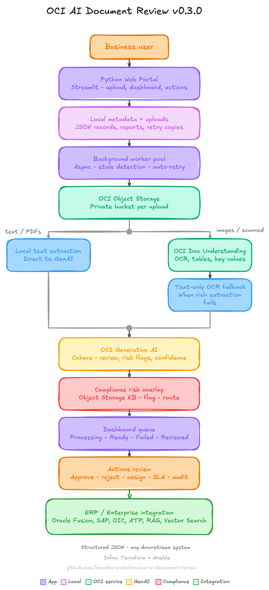

# OCI AI Document Review Portal

## Reference Architecture

The portal is a lightweight OCI-hosted document review workflow. It stores uploaded files in private Object Storage, extracts usable text with the lowest-cost path available, analyzes the content with OCI Generative AI, and routes the result to a human review queue with audit, retry, and approval actions.



The image above is the share-ready reference architecture. Terminal-friendly ASCII diagrams, sequence flows, lifecycle states, refresh behavior, and deployment flows are maintained in `docs/architecture_flows.md`.

## Overview

OCI AI Document Review Portal is an Oracle Cloud Infrastructure application for AI-assisted business document review. It combines Streamlit, OCI Object Storage, OCI Document Understanding, and OCI Generative AI to convert uploaded documents into structured review summaries, risk notes, recommendations, workflow metadata, and downloadable reports.

The repository includes the application code, Terraform infrastructure, Ansible deployment automation, ASCII architecture flows, and documentation for evolving the MVP into an enterprise version with Autonomous Database, APEX or Visual Builder, Vault, Logging, Events, Functions, and a customer document-status chatbot.

Current version: `v0.3.0`

Contact: Leandro Michelino | Oracle ACE | leandro.michelino@oracle.com.

## What This Project Does

This project is a working OCI document review portal for business files such as receipts, invoices, contracts, compliance documents, reports, PDFs, and images.

Users upload a document in the web portal. The platform then:

```text
1. Saves the upload locally and creates an UPLOADED metadata record.
2. Queues the document in a background worker pool so the browser does not wait on OCI processing.
3. Stores the original file in a private OCI Object Storage bucket.
4. Extracts text locally for text-native files and PDFs with selectable text.
5. Uses OCI Document Understanding only for images, scanned PDFs, or image-only PDFs.
6. Falls back to DU text-only OCR when rich table/key-value extraction fails.
7. Sends the extracted content to OCI Generative AI for structured review.
8. Checks the extracted content and user metadata against a curated compliance knowledge base in Object Storage.
9. Auto-detects the document type when `Auto-detect` was selected during upload.
10. Creates a JSON metadata record and a Markdown report.
11. Shows the document in a clean Dashboard queue.
12. Opens the Actions page for AI review, human decision, lifecycle details, and downloads.
13. Lets a reviewer assign ownership, set an SLA, add workflow comments, and inspect the audit trail.
14. Lets failed documents be retried from the preserved local working copy.
15. Lets a reviewer correct the document type, then approve or reject the document.
```

The goal is not to replace human approval. The goal is to give reviewers a real, end-to-end AI-assisted workflow that reduces manual reading, highlights risks, and keeps the final decision with a person.

## What Happens After Upload

After the user clicks Queue Document, the portal accepts the file, creates a metadata record, and queues the live backend workflow. The Dashboard shows the queue while workers process documents in parallel.

```text
User uploads file
  |
  v
Local working copy saved
  |
  v
Metadata status is set to UPLOADED
  |
  v
Background worker pool accepts the job
  |
  +--> Worker 1 processes a document
  |
  +--> Worker 2 processes another document
  |
  v
Original file uploaded to OCI Object Storage
  |
  v
Text is extracted locally or with OCI Document Understanding OCR
  |
  v
DU text-only OCR fallback is used when rich extraction fails
  |
  v
OCI Generative AI creates structured review
  |
  v
Public-sector expense cues are flagged for compliance attention
  |
  v
Auto-detected document type is applied when requested
  |
  v
Metadata and Markdown report are saved
  |
  v
Dashboard shows the document as Ready
  |
  v
Reviewer opens the Actions page
  |
  v
Reviewer assigns owner, SLA, workflow status, or comments
  |
  v
Reviewer approves or rejects the document
```

The Dashboard is intentionally action-oriented. It shows queue metrics, a next-action panel, global search, Upload and Actions shortcuts, a Processing queue, a horizontal Ready band for approval work, paired Failed and Reviewed queues, and an `Open` action directly in front of each file.

The Actions page is where review work happens. It prioritizes documents that need approval, rejection, compliance review, escalation, waiting-for-information follow-up, or a failed-processing fix. Reviewers can download the original source document for review when the local working copy is available. Documents that match the curated compliance knowledge base show `Compliance review` and a high-risk badge. Ordinary ready documents show `Approve or reject`. Failed documents show `Fix and retry` until a retry is queued. Reviewed documents show `Approved` or `Rejected`. Workflow fields track status, assignee, SLA due date, comments, audit events, and retry history in the local JSON metadata.

Text-native files and PDFs with selectable text go directly to GenAI after local text extraction. Image files and PDFs without usable embedded text use OCI Document Understanding first, with a text-only OCR fallback when rich extraction fails. Public-sector expense matches are flagged as compliance attention risks and force human review. If the upload type was `Auto-detect`, GenAI classifies the document and the reviewer can still correct the type before approval.

## Compliance Knowledge Base

The compliance router uses a curated CSV/JSON knowledge base instead of asking GenAI to search the internet. The default Object Storage object is:

```text
compliance/public_sector_entities.csv
```

If that object is missing, the app seeds it from:

```text
data/compliance/public_sector_entities.csv
```

During processing and backfill, the app checks extracted text, file name, business reference, notes, and selected AI fields against the catalog. Matching expense-like documents receive a `Public-sector expense compliance review` risk note with auditable evidence that includes the source object, matched term, entity type, country, source, and source date. Those documents stay in the Ready queue and appear in Actions as `Compliance review`.

If OCI Generative AI blocks a prompt with the service content safety filter, the app no longer exposes the raw provider JSON to the reviewer. It creates a manual-review analysis with `Risk High`, explains that automatic AI analysis was blocked, keeps the extracted text preview available for review, and sanitizes existing metadata/report display paths so stored provider JSON is replaced with the reviewer-safe message.

## Field Reference

The portal shows a `?` marker beside the main review and file fields. Hover over it in the app to see the same definitions below.

| Field | Meaning |
| --- | --- |
| Status | Processing state for the document lifecycle, from upload through approval or failure. |
| Stage | Simplified queue state shown in the Dashboard: `Queued`, `Processing`, `Ready`, `Reviewed`, or `Failed`. |
| Review | Human review decision state: `PENDING`, `APPROVED`, or `REJECTED`. |
| Risk | Highest AI or compliance risk-note severity for the document, with note counts and supporting evidence shown in the Dashboard and Analysis details. Documents with no risk show only a small green signal; actionable risks use severity badges labeled `Risk Small`, `Risk Medium`, and `Risk High`, plus a reviewer-friendly Risk review panel that summarizes compliance matches and expense cues. Public-sector expense matches from the curated knowledge base are raised as compliance attention. |
| Confidence | AI confidence score returned by the review analysis, shown as 0 to 100 percent. It is not a guarantee of correctness. |
| Action | The next human or operational step for the selected document. |
| Workflow | Human workflow state for assignment, SLA tracking, escalation, retry planning, and closure. |
| Assignee | Person, team, or queue responsible for the next action. |
| SLA | Due date for the current review workflow. |
| Retries | Number of retry attempts recorded for this document. |
| Document type | Review category chosen during upload or detected by GenAI. Reviewers can correct it before approval. |
| File name | Original uploaded file name. |
| Extension | File extension from the uploaded file name. |
| File size | Original upload size captured by the portal for new uploads. |
| MIME type | Browser-reported file content type captured during upload. |
| Business reference | Optional user-provided reference, such as invoice number, case ID, or contract ID. |
| Document ID | Internal portal identifier created for this processing run. |
| Report | Whether a Markdown review report exists on the VM. |
| Text preview | Number of extracted characters stored for quick inspection in the portal. |
| Storage | Whether the original file has an OCI Object Storage path recorded. |
| Parallel jobs | Number of background worker threads allowed to process documents at the same time. |

Confidence, extracted fields, recommendations, missing information, and risk notes are AI-assisted signals. A human reviewer must still verify the document and make the final approval or rejection decision.

## OCI Deployment

The project is intended to be deployed from your local laptop into your own OCI compartment.

Source control and live deployment are separate steps. A Git commit and push updates GitHub only; it does not update the running OCI VM. To make a source change visible in the portal, commit and push the change, then run `./scripts/deploy.sh` from the repo root so Ansible unpacks the release into `/opt/oci-ai-document-review` and restarts the `oci-ai-document-review` systemd service.

```text
Name: oci-ai-document-review
OCID: ocid1.compartment.oc1..exampleproject
Parent: ocid1.compartment.oc1..exampleparent
```

Use your own compartment OCIDs, Object Storage namespace, region, SSH key, and ingress CIDR in local files only.

## Platform Usage

Detailed Terraform outputs, Ansible output, deployment flow, operations commands, and portal usage instructions are in `docs/platform_usage.md`. Current review findings, cleanup decisions, and verification commands are tracked in `docs/repository_review.md`.

## Preflight Verification

The app is wired to real OCI services. It does not use simulated processing in the runtime path.

Before processing customer documents, open `Settings` and run `OCI Preflight`. It performs live checks with the same credentials used by processing:

- Object Storage bucket reachability plus write, read, and delete.
- Document Understanding API access in the configured compartment.
- Generative AI model response in the selected GenAI region.

The processing path is:

```text
Uploaded file
  -> background worker queue
  -> private Object Storage bucket
  -> local text extraction OR OCI Document Understanding using ObjectStorageDocumentDetails
  -> DU text-only OCR fallback when rich table/key-value extraction fails
  -> JSON-safe extraction result conversion when Document Understanding is used
  -> OCI Generative AI Cohere chat model
  -> compliance knowledge-base match from Object Storage
  -> compliance risk overlay and Actions routing
  -> automatic document type label when Auto-detect was selected
  -> local metadata JSON
  -> Markdown report
  -> Dashboard queue
  -> Actions page
  -> workflow assignment, comments, audit, retry, approval/rejection
```

If local extraction or Document Understanding returns no text, the app fails clearly instead of sending empty content to GenAI.

PDFs that contain scanned pages or embedded images are handled through OCI Document Understanding OCR. They can take much longer than PDFs with selectable text because OCI must read the pixels on each page. Very large, low-quality, rotated, password-protected, or image-heavy PDFs may still fail or return little text. For best results, use clear scans, normal page orientation, and files below the configured upload limit.

Document Understanding calls are bounded by runtime settings:

```text
DOCUMENT_AI_TIMEOUT_SECONDS=180
DOCUMENT_AI_RETRY_ATTEMPTS=2
STALE_PROCESSING_MINUTES=12
MAX_PARALLEL_JOBS=2
```

Uploads are queued into a background worker pool. The browser returns immediately after submission, and workers process up to `MAX_PARALLEL_JOBS` documents at the same time. If a browser session is interrupted or a processing run stays in an active stage beyond the stale window, the portal marks it as `FAILED` with a retry message instead of leaving it stuck.

## Cost Estimate

An illustrative cost estimate and pricing worksheet is available in `docs/cost_estimate.md`.

This estimate is not an official Oracle quote and may not be realistic for your tenancy, usage, region, discount terms, or free tier eligibility. Use the Oracle Cost Estimator and request a formal quote from your Oracle representative before using it for budgeting or production planning.

## Prerequisites

- Python 3.11 or later
- Terraform 1.x
- Ansible
- An OCI account with an API key and IAM policies for Object Storage, Document Understanding, and Generative AI
- An SSH key pair for VM access

## Setup

### 1. Create the virtual environment

```bash
python3.11 -m venv .venv
source .venv/bin/activate
pip install -r requirements-dev.txt
```

### 2. Run the setup wizard

`scripts/setup.py` is the only step that collects your environment-specific values. It reads your existing OCI CLI profile, probes live OCI services, and writes the two local files that Terraform and the app need. It does not create any OCI resources.

```bash
python scripts/setup.py
```

The wizard walks through five steps:

```text
Step 1 — OCI Credentials
  Reads ~/.oci/config (or --config-file) and validates the API key.
  Confirms tenancy, user, and profile region before continuing.

Step 2 — Project Compartment
  Asks for the parent compartment OCID and the project compartment OCID.

Step 3 — Regions
  Lists your READY subscribed OCI regions.
  Selects the home/IAM region and the runtime region separately.

Step 4 — Storage, Network, and Runtime
  Object Storage bucket name and namespace (auto-discovered from OCI).
  Allowed ingress CIDR (auto-discovers your current public IP as /32).
  SSH public key path (offers to generate an RSA key pair if none exists).
  Compute shape, OCPU count, and memory.
  Processing limits: upload size, parallel jobs, DU timeout and retries.

Step 5 — Generative AI
  Probes all subscribed regions in parallel for active Cohere chat models.
  Shows only supported GenAI regions for this app.
  Prompts you to select a region and a model.
```

After you confirm, the wizard writes:

```text
.env                        Runtime configuration for the Streamlit app
terraform/terraform.tfvars  Infrastructure variables for Terraform
```

Neither file is committed to Git. Both are in `.gitignore`.

### Setup flags

| Flag | Default | Purpose |
| --- | --- | --- |
| `--config-file` | `~/.oci/config` | OCI config file path |
| `--profile` | `DEFAULT` | OCI config profile name |
| `--compartment-id` | — | Project compartment OCID |
| `--parent-compartment-id` | — | Parent compartment OCID |
| `--home-region` | — | Home/IAM region |
| `--runtime-region` | OCI profile region | Region for compute, Object Storage, and DU |
| `--allowed-ingress-cidr` | auto-discovered `/32` | Trusted CIDR for SSH and portal access |
| `--ssh-public-key-path` | `~/.ssh/id_rsa.pub` | Public key deployed to the VM |
| `--generate-ssh-key` | `false` | Generate an RSA key pair if none exists |
| `--instance-shape` | `VM.Standard.A1.Flex` | Compute shape |
| `--instance-ocpus` | `1` | OCPU count |
| `--instance-memory-gbs` | `6` | Memory in GB |
| `--max-parallel-jobs` | `2` | Background worker thread count |
| `--max-upload-mb` | `10` | Maximum upload size in MB |
| `--max-document-chars` | `50000` | Maximum extracted characters sent to GenAI |
| `--non-interactive` | `false` | Skip all prompts (requires compartment and regions) |
| `--yes` | `false` | Skip the final write confirmation |

### Non-interactive mode

For repeatable or automated setups, pass all required values as flags:

```bash
python scripts/setup.py \
  --compartment-id ocid1.compartment.oc1..exampleproject \
  --parent-compartment-id ocid1.compartment.oc1..exampleparent \
  --home-region us-ashburn-1 \
  --runtime-region us-ashburn-1 \
  --allowed-ingress-cidr 203.0.113.10/32 \
  --non-interactive
```

### After the wizard finishes

The wizard prints these next steps on completion:

```text
1. Review .env and terraform/terraform.tfvars
2. cd terraform && terraform plan
3. ./scripts/deploy.sh
4. Open Settings in the portal and run OCI Preflight
```

Ingress CIDR notes:

- A single host IP such as `203.0.113.10` is automatically normalized to `203.0.113.10/32`.
- Open ingress such as `0.0.0.0/0` is rejected by setup and again by Terraform variable validation.
- If setup cannot reach the IP-discovery service, re-run with `--allowed-ingress-cidr` set explicitly.

## Infrastructure

Terraform files are ready under `terraform/`.

This repository is designed for local laptop deployment. It does not include GitHub Actions or any Git-based deployment automation. Your local OCI config, API keys, `.env`, Terraform state, and real `terraform.tfvars` are ignored and must not be committed. The Terraform provider lock file is tracked so provider resolution stays consistent across machines.

The setup wizard is the recommended way to create local variables. For manual recovery or advanced edits, you can copy the sample:

```bash
cp terraform/terraform.tfvars.example terraform/terraform.tfvars
```

Then edit `terraform/terraform.tfvars` with your own compartment OCIDs, namespace, regions, ingress CIDR, and SSH public key path.

```bash
cd terraform
terraform init
terraform plan
```

The plan prepares a private Object Storage bucket, VCN, public subnet, private subnet, security lists, public and private route tables, Internet Gateway, NAT Gateway, Service Gateway, and compute VM. It does not use NSGs. Terraform validates network CIDR syntax, rejects open ingress, and requires positive flexible-shape sizing before apply.

Deploy end to end:

```bash
./scripts/deploy.sh
```

The deployed VM uses the existing OCI API key and policies from your local OCI profile. For code-only changes, Terraform should normally report no infrastructure changes, while Ansible still refreshes the app archive, writes runtime configuration, installs dependencies if needed, and restarts Streamlit.

After deployment, verify the live VM rather than relying on GitHub state:

```bash
ssh -i ~/.ssh/id_rsa opc@<vm-public-ip> "grep -n 'def dashboard_metrics_html' /opt/oci-ai-document-review/app.py && sudo systemctl is-active oci-ai-document-review"
curl -fsS -I http://<vm-public-ip>:8501
```

If the browser still shows an old dashboard after a successful deploy, reload the page so the Streamlit session reconnects to the restarted service.

The release package excludes local-only files and runtime-unneeded artifacts such as `.git/`, `.env`, `.oci/`, `.venv/`, Python caches, `terraform.tfvars`, Terraform state, API keys, private keys, and local metadata. Ansible also scrubs sensitive file patterns after unpacking before writing the intended runtime `.env` and OCI SDK config.

## Run Locally

```bash
streamlit run app.py
```

The app supports:

- Document upload
- Object Storage upload
- Document Understanding extraction
- GenAI JSON analysis
- Background worker queue with parallel processing
- Markdown report generation
- Local JSON metadata
- Approve and reject review actions
- Dashboard queue view with metrics, next-action guidance, search, split queue tables, shortcuts, and per-row Open actions
- Actions page for prioritized approvals, source-document download, assignment, SLA tracking, comments, audit trail, retry history, failed-document follow-up, AI summary, lifecycle, extracted text, and downloads
- Processing lifecycle view for each document
- Field guide with `?` explanations for review and file metadata fields
- OCI Preflight checks in Settings

## Versioning

The project uses semantic-style MVP versioning: `vMAJOR.MINOR.PATCH`.

- `MAJOR`: production-breaking architecture or data model changes.
- `MINOR`: visible workflow, cloud integration, or capability changes.
- `PATCH`: bug fixes, documentation updates, and small UX refinements.

The current source-of-truth version is `src/version.py`, and release notes are tracked in `CHANGELOG.md`.

## Future Enhancements

- Add Autonomous Database for metadata
- Add APEX or Visual Builder as enterprise frontend
- Add a customer document chatbot for status, rejection reason, retry, owner, SLA, and risk-summary questions
- Add OCI Events and Functions for automatic processing
- Add OCI Vault for secrets
- Add OCI Logging for operational visibility

### Next Phase: Customer Document Chatbot

A future phase can add a read-only chatbot so customers can ask natural-language questions about uploaded documents, such as `What is the status of my file?`, `Why was it rejected?`, `Who is reviewing it?`, or `What should I upload again?`.

The chatbot should answer from trusted application data only: local or database-backed metadata, audit events, workflow comments, generated reports, extracted summaries, and approval/rejection decisions. It should not make final approval decisions or invent missing information. In the enterprise version, this assistant should sit behind authentication and authorization so each customer only sees documents they are allowed to access.
